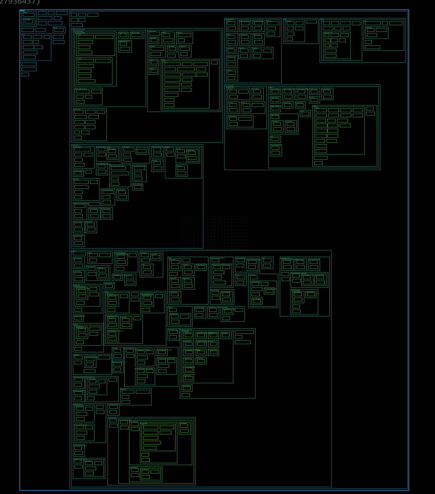
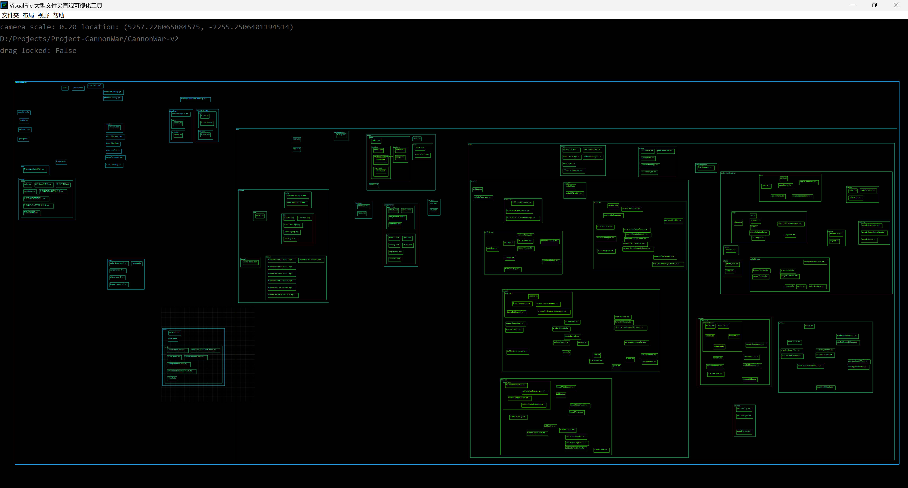
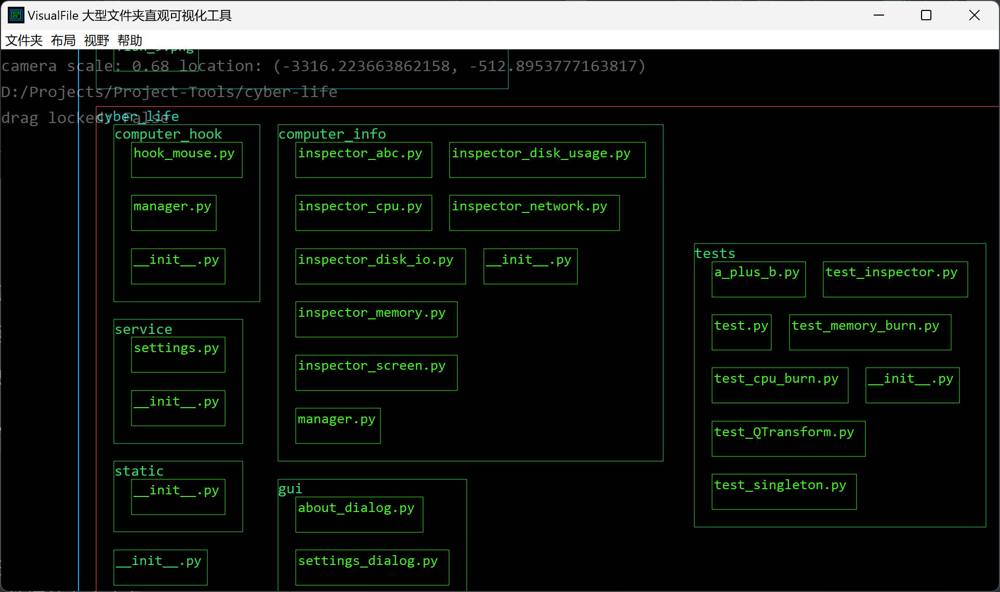
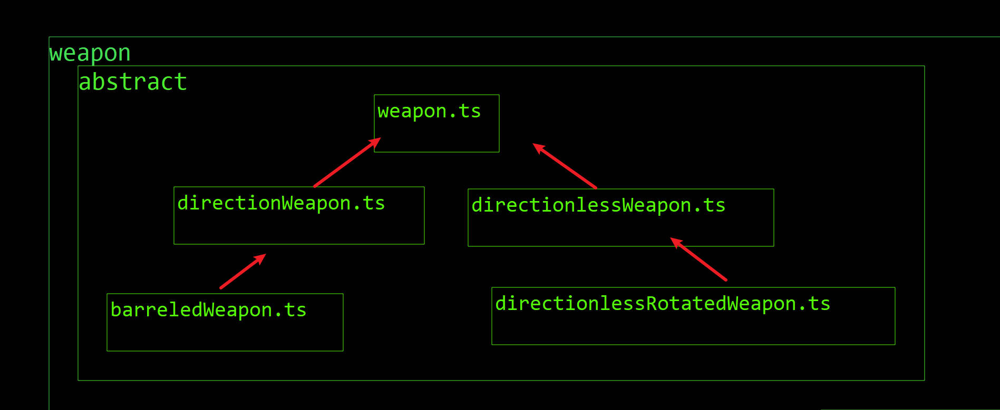

# 项目代码直观查看工具 visual-file

## 效果图

默认生成效果



自定义摆放后



放大细节



## 特点

1. 直观的展示项目文件结构，支持多层级目录结构

2. 双击矩形打开文件

3. 无限放大缩小、无边界移动、自由拖拽摆放布局并保存

## 解决痛点

项目太大，文件太多，普通的编辑器左侧列表太长，翻阅文件困难，需要一个工具来快速找到并打开文件。

我们是三维空间中的碳基生命，我们的视网膜是二维的，所以二维信息包含了上下左右等相对位置信息。比IDE里的一维缩进列表更加丰富。我们可以利用好二维空间、更有逻辑地来摆放文件，比如摆的越靠上可以代表越接近逻辑顶层，越靠下可以代表越接近工具底层、越靠左代表越接近数据层、越靠右代表越接近UI交互层……，（您可以发挥任意想法）。

或者以一定的图案摆放，这样一看到我们自己摆放的图案，想到找某个文件就能立刻根据空间记忆立刻找到，双击即可打开。不需要再在一维的列表中来回上下翻找。



如上所示，可以把这五个 ts 文件根据继承关系摆放成三角形，方便快速找到。

类似 SpaceSniffer，屏幕上铺满了大大小小的嵌套的矩形框，每个矩形框代表一个文件夹或者文件，以二维的方式直观的打开项目工程文件，所有代码文件一览无余的，以二维的方式直观的展现在面前。

双击某个矩形框打开代码文件的原理：

python 调用系统默认程序打开文件。直接导致编辑器里实现了打开某个代码的功能。
需要提前将 ts 文件的默认打开方式设置成对应的编辑器程序，比如 vscode。

```
os.startfile(full_path_file)
```

## 使用提示

windows系统不知道为什么，可能会报警病毒，但源代码全部开源，无恶意代码，请放心使用。

实际上在我打包的时候就直接报警有病毒强制给删了。所以不得不手动设置信任才能成功打包。

默认的全局排除里会排除.git 等文件目录，可以根据自己的需要进行修改。

## TODO:

为不同的后缀名文件渲染不同的图标。

当缩小到一定程度的时候，文件夹里面的内容不显示，只显示一个大的文件夹名称

全局排除的正则排除功能


## 开发相关：

此项目为LiRen团队开源项目，贡献代码前建议阅读开发规范文档中的python内容：https://liren.zty012.de/

更新 assets 资源文件指令

```commandline
pyrcc5 -o assets/image.rcc -o assets/assets.py
```

打包指令

```commandline
windows:
pyinstaller --onefile --windowed --icon=./assets/favicon.ico main.py -n visual-file
macOS:
pyinstaller --onefile --windowed --icon=./assets/visual-file.icns main.py -n visual-file
```

## 布局文件格式

```js
{
	"layout": [
        {
            "kind": "directory" | "file",
            "name": "abc",  // 文件夹名字或者文件名，不需要全路径，只需要一个名字即可
            "bodyShape": {
                "width": 500,
                "height": 100,
                "locationLeftTop": [155, 4154]
            },
            "children": [
                // ...继续嵌套
            ]
        }
    ]
}
```
